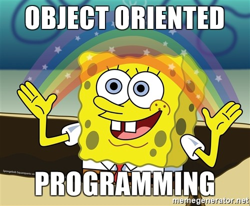
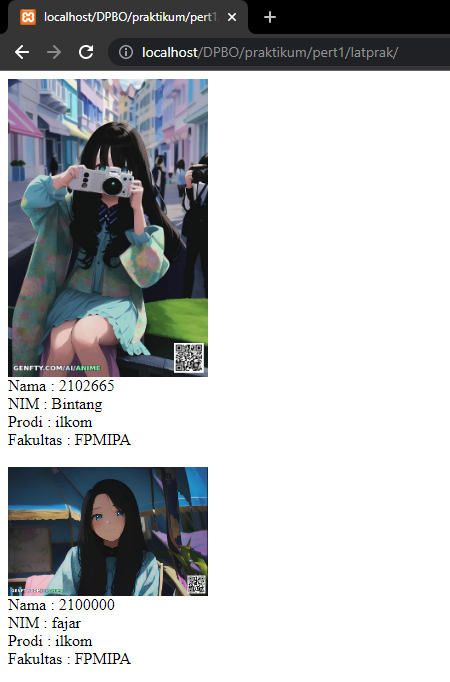
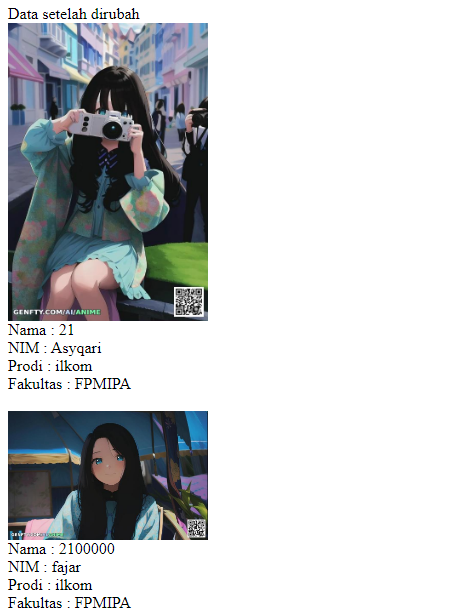
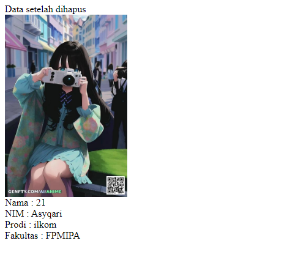
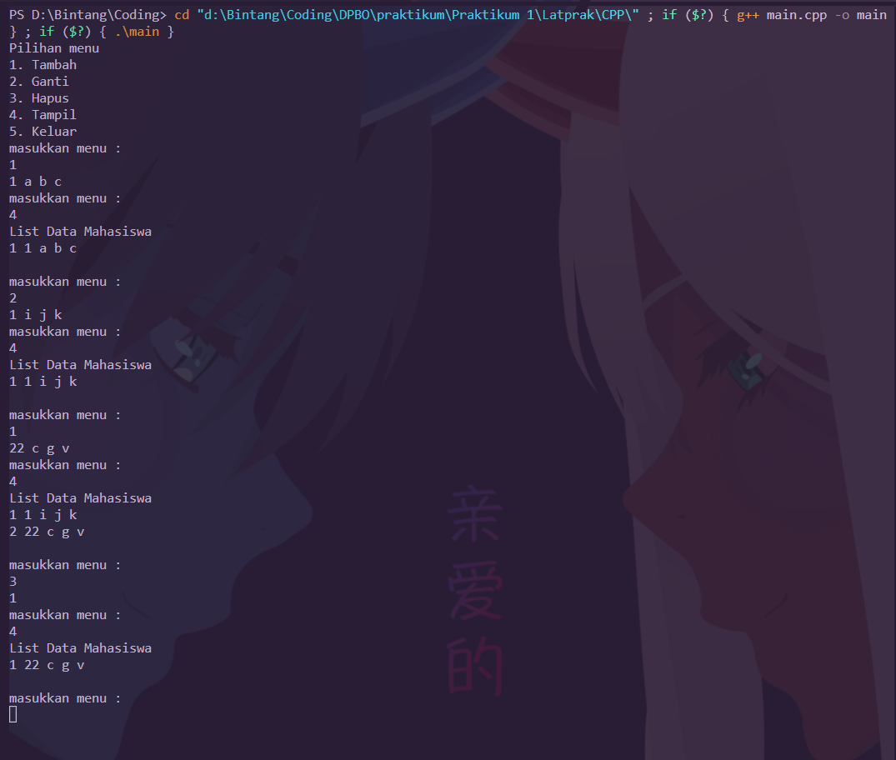
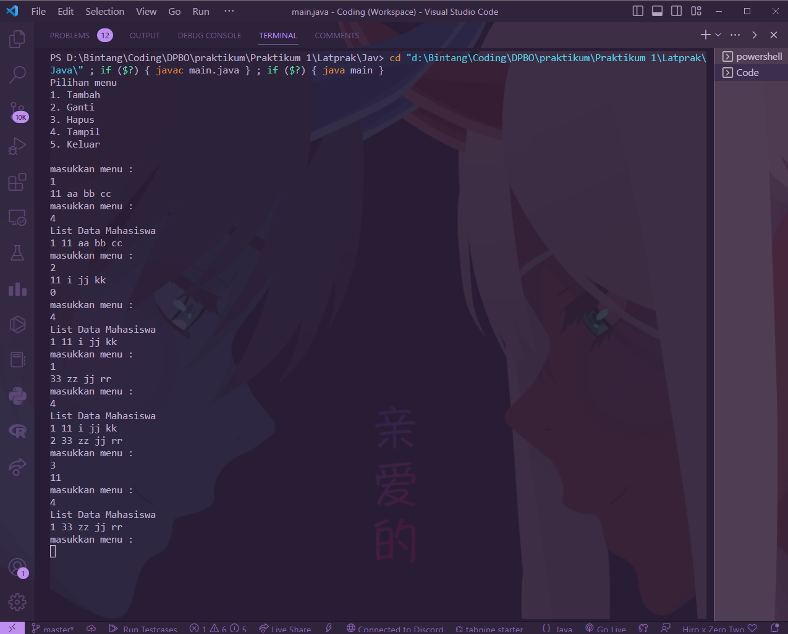
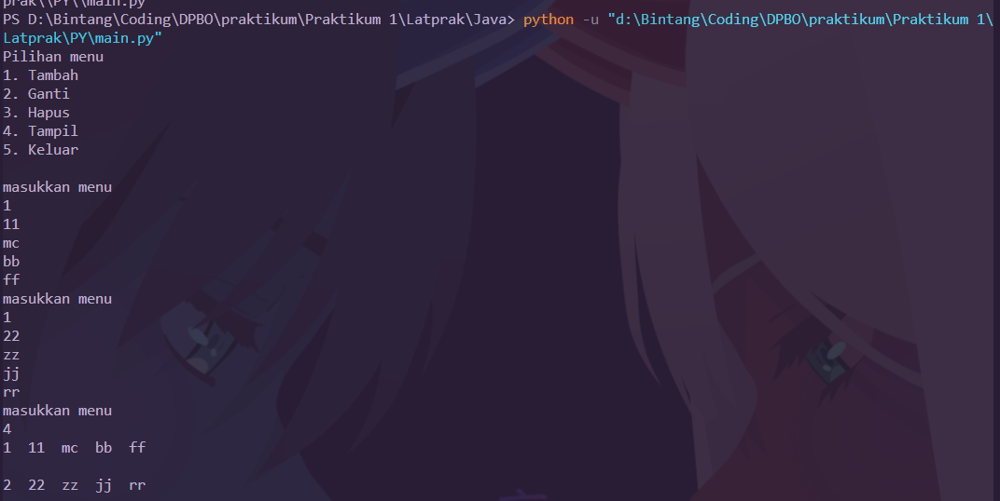
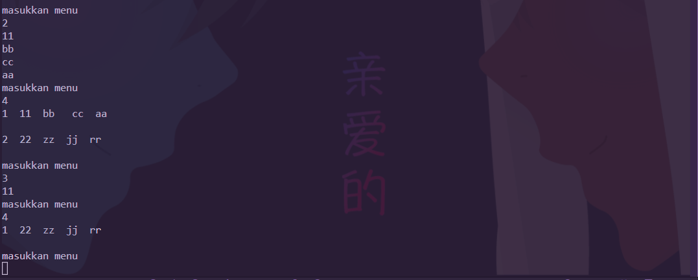

# Janji
Saya Muhammad Cahyana Bintang Fajar NIM 2102665 mengerjakan Latihan 1 dalam mata kuliah Desain dan Pemrograman Berorientasi Objek untuk keberkahanNya maka saya tidak melakukan kecurangan seperti yang telah dispesifikasikan. Aamiin.

## Desain Program 
Terdiri dari 1 class yaitu **Mahasiswa**

Didalam class **Mahasiswa** memiliki 4 Atribut, yaitu : 
* Nama
* NIM
* Prodi
* Fakultas

dan tambahan untuk bahasa **PHP** ada atribut tambahan yaitu 
* Foto

## Alur Program
- Untuk menjalankan program, tinggal run saja program tergantung dari bahasa yang ingin di run
- Terdapat 5 menu, Yaitu
* `Tambah` Yaitu menu yang digunakan untuk menambah data
* `Ganti` Yaitu menu yang digunakan untuk mengubah data
* `Hapus` Yaitu menu yang digunakan untuk menghapus data
* `Tampil` Yaitu menu yang digunakan untuk menampilkan data
* `Keluar` Yaitu menu yang digunakan untuk keluar dari program

Program saya mempunyai 1 Primary key, Yaitu NIM, Oleh karena itu
* ketika ingin menambah data, maka NIM harus unik
* ketika ingin mengubah data, maka NIM harus ada, jika tidak ada NIM, maka data tidak dapat di ubah
* ketika ingin menghapus data, menggunakan NIM, jika tidak ada nim yang terdaftar maka data tidak bisa dihapus

## Dokumentasi 

### Dokumentasi PHP

### Dokumentasi CPP

### Dokumentasi Java

### Dokumentasi Python

